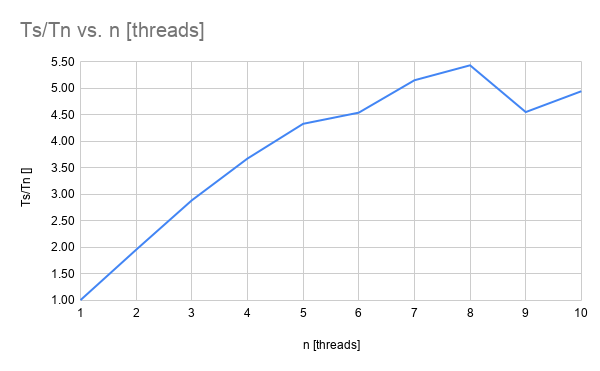

# PPR Exercise 2

*Michael Riedmann (se19m020)*

## Ansatz / Erklärung / Diskussion

Als erstes wurde die notwendige Berechnung ohne Fokus auf parallelisierung, jedoch mit starken
Ansprüchen an Lesbarkeit, Verständlichkeit und Richtigkeit, implementiert. Während der Umsetzung
wurde durch den simplistischen Ansatz einige Entscheidungen getroffen:
* Es wurde auch ein Kommandozeileninterface verzichtet. Die Werte müssen direkt im Source-Code
 gesetzt werden.
* Es wurde explizit eine globale "image" Variable eingesetzt, da das gesamte Programm nur diesem
 einen Zweck dient und kein reuse des Codes geplant ist.
* Die Einfärbung wird durch das berechnen der "Hue" in der HSV Farbpalette erzielt. Dies ist
 ein gängiger und leicht zu verstehender Ansatz.
* Zur besseren visuellen Repräsentation wurden die Werte (n) über eine logarithmische Skala
 transformiert und die Anfangswerte besser hervorzuheben.
 
Nach der erfolgreichen Implementierung wurde das Programm mit minimalen Maßnahmen parallelisiert.
Dafür wurde zuerst der Berechnungsschritt von der Ausgabe getrennt. Somit konnte der IO-Anteil
in einen eigenen, sequentiellen Teil ausgelagert werden. Die restliche Berechnung konnte ohne
größere Adaptionen über `omp parallel for collapse(2) schedule(static,16)` parallelisiert werden.
Die Entscheidung zu `schedule(static)` wurde getroffen, nachdem `dynamic` nach ersten tests eine
schlechtere Performance zeigte. Obwohl aus dem Problem keine zwingende Gleichmäßigkeit hervorgeht,
ist zumindest für diesen Ausschnitt des Problemraums eine hohe Gleichmäßigkeit des Rechenaufwands
erkennbar. Die chunk size von 16 wurde durch Tests ermitteln, nachdem die Performance ohne setzen
zu keinen zufriedenstellenden Werten geführt hat. Es kann angenommen werden, dass die Berechnung
für 1 Pixel zu kurz läuft und der overhead der Thread-Switches damit mein 1px/Thread zu hoch ist.
 
Um zuverlässige Vergleichswerte zu erhalten, wurde der sequenzielle Teil, wenn auch unnötig, im
ausführenden Pfad behalten. Die Kennzahl Ts/Tn kann damit direkt von Programm ausgegeben werden.
Die Messung über verschiedene Threads wurde mittels BASH Kommando ausgeführt (s.u.) und die
Ergebnisse mittels Google Spreadsheet geplottet.
 
Allgemein konnte ein zufriedenstellenden Parallelisierungsgrad erreicht werden. Der Abfall ab
N4 ist darauf zurückzuführen, dass es sich bei der Testmaschine um einen 4 Kern CPU (Intel i7)
handelt. Die flache Steigung bis N8 wird durch das verfügbare Hyper Threading Feature der CPU
verursacht, dass 2 virtuelle Kerne pro CPU-Kern anbietet. Ab >N8 ist damit keine effizienter
Performancegewinn mehr ersichtlich.

## Messwerte

```bash
for i in {1..10};do printf "$i\n"; OMP_NUM_THREADS="$i" ./ppr_exercise_2; done
```

| n [threads]            | 1    | 2    | 3    | 4    | 5    | 6    | 7    | 8    | 9    | 10   |
|------------------------|------|------|------|------|------|------|------|------|------|------|
| Serial Calc Time [s]   | 1.43 | 1.45 | 1.43 | 1.43 | 1.43 | 1.46 | 1.46 | 1.43 | 1.42 | 1.45 |
| Parallel Calc Time [s] | 1.42 | 0.74 | 0.50 | 0.39 | 0.33 | 0.32 | 0.28 | 0.26 | 0.31 | 0.29 |
| Ts/Tn                  | 1.01 | 1.96 | 2.89 | 3.68 | 4.33 | 4.54 | 5.16 | 5.44 | 4.55 | 4.95 |
| Draw Time [s]          | 0.04 | 0.04 | 0.04 | 0.04 | 0.05 | 0.05 | 0.04 | 0.05 | 0.04 | 0.04 |
| Write Time [s]         | 0.11 | 0.11 | 0.11 | 0.11 | 0.11 | 0.11 | 0.11 | 0.11 | 0.12 | 0.12 |


